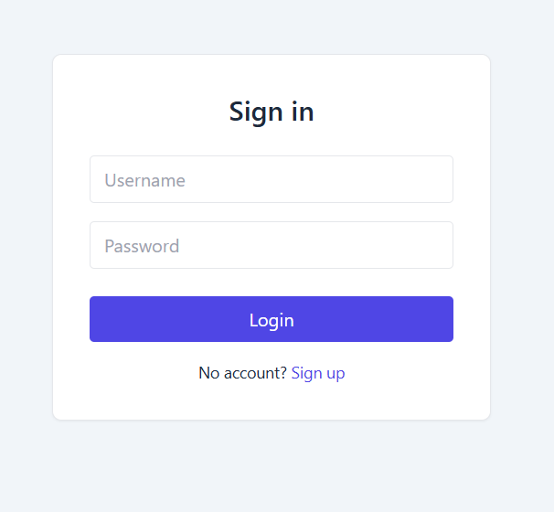
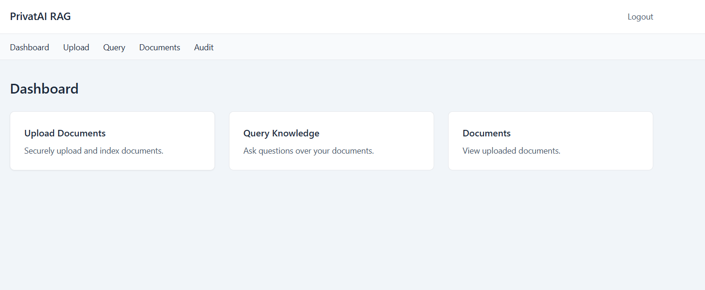
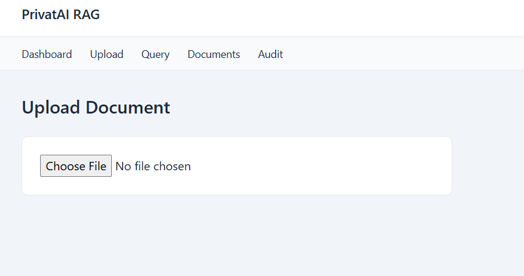
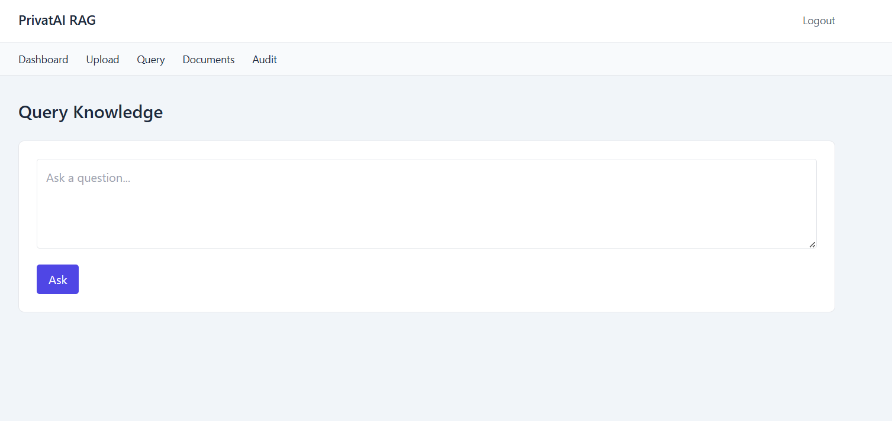

# PrivatAI-RAG

> Privacy-Preserving, Zero-Trust Retrieval-Augmented Generation (RAG) Platform built with FastAPI, React, Qdrant, Ollama, and Docker.

PrivatAI-RAG is a secure document intelligence platform that enables users to upload private documents, generate semantic embeddings, retrieve context-aware information, and interact with a locally hosted Large Language Model (LLM) without exposing sensitive data to external AI providers.

The system combines modern RAG architecture, vector search, authentication, access control, audit logging, and containerized deployment into a production-oriented AI application.

---

# Features

## Authentication & Authorization

* User Registration and Login
* JWT-Based Authentication
* Role-Based Access Control (RBAC)
* Protected API Endpoints
* Scope-Based Permissions

## Document Intelligence

* PDF Document Upload
* Automated Text Extraction
* Intelligent Document Chunking
* Metadata Management
* Content Hashing

## Retrieval-Augmented Generation (RAG)

* Semantic Embeddings using Sentence Transformers
* Vector Search with Qdrant
* Context-Aware Retrieval
* Local LLM Inference through Ollama
* Secure Context Injection

## Security & Governance

* Tenant Isolation
* Policy-Aware Retrieval
* Audit Logging
* Zero-Trust Design
* Local-Only AI Processing

## DevOps & Deployment

* Fully Dockerized Architecture
* Frontend + Backend + Vector Database + LLM
* Nginx Reverse Proxy
* One-Command Deployment

---

# System Architecture

```text
                 +----------------------+
                 |      Frontend        |
                 |    React + Vite      |
                 +----------+-----------+
                            |
                            v
                 +----------------------+
                 |      FastAPI         |
                 |      Backend         |
                 +----------+-----------+
                            |
          +-----------------+-----------------+
          |                                   |
          v                                   v

 +----------------------+      +----------------------+
 |        Qdrant        |      |       Ollama         |
 |    Vector Store      |      |      Local LLM       |
 +----------------------+      +----------------------+

            ^
            |
            |
 +----------------------+
 |    Uploaded PDFs     |
 +----------------------+
```

---

# Technology Stack

## Backend

* FastAPI
* SQLAlchemy
* SQLite
* Pydantic
* JWT Authentication

## Frontend

* React
* Vite
* Axios
* Tailwind CSS

## AI & RAG Stack

* Sentence Transformers
* Qdrant Vector Database
* Ollama
* Llama 3
* Embedding-Based Retrieval

## Infrastructure

* Docker
* Docker Compose
* Nginx

---

# Application Screenshots

## Login Interface



---

## User Dashboard



---

## Document Upload



---

## Query Interface



---

# Retrieval Workflow

```text
PDF Upload
     │
     ▼
Text Extraction
     │
     ▼
Chunk Generation
     │
     ▼
Embedding Creation
     │
     ▼
Qdrant Vector Storage
     │
     ▼
Semantic Retrieval
     │
     ▼
Context Assembly
     │
     ▼
Ollama Response Generation
```

---

# Security Model

PrivatAI-RAG follows a Zero-Trust Architecture where every request is authenticated, authorized, and audited.

Security mechanisms include:

* JWT Authentication
* Role-Based Access Control
* Tenant Isolation
* Policy-Aware Retrieval
* Audit Logging
* Local LLM Execution
* No External AI API Dependency

---

# Running the Project

## Clone Repository

```bash
git clone <repository-url>

cd privatai-rag
```

## Start All Services

```bash
docker compose up --build
```

---

# Service Endpoints

| Service          | URL                             |
| ---------------- | ------------------------------- |
| Frontend         | http://localhost:3000           |
| Backend API      | http://localhost:8000           |
| Swagger UI       | http://localhost:8000/docs      |
| Qdrant Dashboard | http://localhost:6333/dashboard |
| Ollama API       | http://localhost:11434          |

---

# User Workflow

1. Create an Account
2. Login and Receive JWT Token
3. Upload Documents
4. Generate Embeddings
5. Store Vectors in Qdrant
6. Query Uploaded Knowledge
7. Receive Context-Aware Responses

---

# Project Highlights

* End-to-End Retrieval-Augmented Generation Pipeline
* Local LLM Deployment with Ollama
* Secure Document Processing
* Semantic Search Architecture
* Policy-Aware Knowledge Retrieval
* Dockerized Multi-Service Deployment
* Enterprise-Oriented Security Design

---

# Future Enhancements

* Multi-Tenant Enterprise Workspaces
* Hybrid Search (Keyword + Semantic)
* Source Citations
* Reranking Pipelines
* Document Versioning
* Kubernetes Deployment
* Single Sign-On (SSO)
* Advanced Policy Engine
* Observability & Monitoring

---

# Current Status

## Completed

* User Authentication
* Role-Based Authorization
* Document Upload Pipeline
* Semantic Embedding Generation
* Qdrant Integration
* Ollama Integration
* Docker Deployment
* Frontend Dashboard
* Query Interface
* Audit Logging

## In Progress

* Upload Pipeline Hardening
* Retrieval Optimization
* Production Readiness Improvements
* Enhanced Policy Enforcement

---

# Author

## Chinmay Patil

AI Engineer | Machine Learning | LLMs | RAG Systems | MLOps

LinkedIn: https://www.linkedin.com/in/chinmay-patil-10xyz/

---

If you found this project interesting, feel free to connect with me on LinkedIn for discussions around AI Engineering, RAG Systems, MLOps, and Applied Machine Learning.
